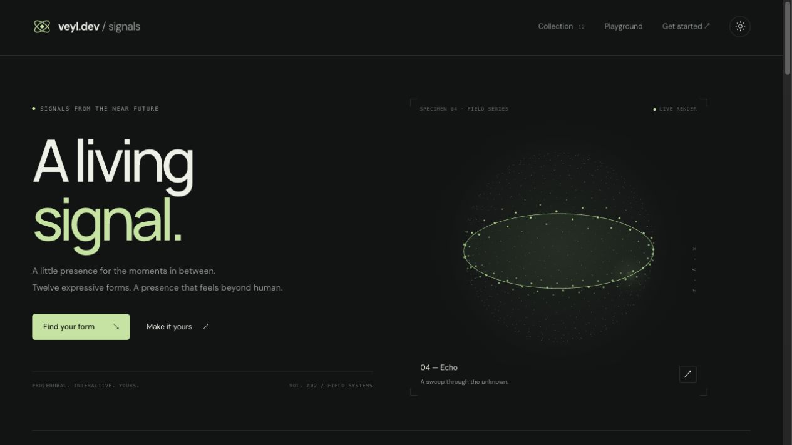
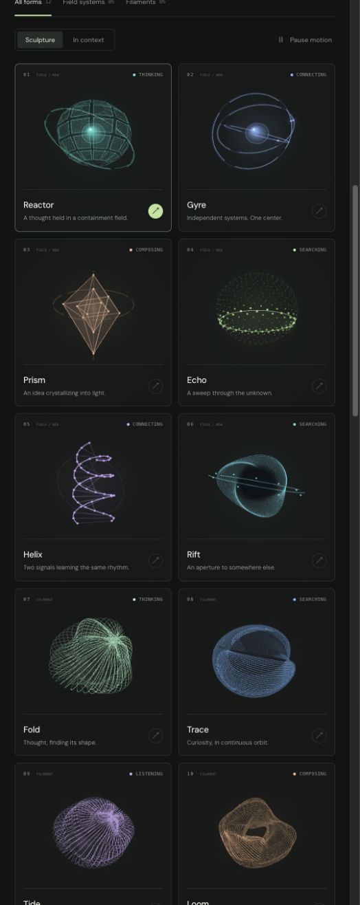

# veyl.dev

**Procedural signal orbs for AI products.** Twelve original forms, drawn live in Canvas and delivered as a native Web Component.

[](LICENSE)
[](#)
[](#quick-start)

<p align="center">
  
</p>

<p align="center"><em>12 forms. 6 meaningful agent states. One lightweight custom element.</em></p>

## What it is

Veyl (pronounced “veil”) adds a small, expressive visual cue beside an AI agent's real activity. Its orbs are calculated and rendered in Canvas 2D in the browser. There are no bundled videos, image sequences, external rendering engines, or runtime dependencies.

The library includes twelve distinct forms: six procedural filament forms and six more structured field systems. Each form has its own geometry and motion. Use `state` to represent what the host app is actually doing; choose `variant` separately to give the signal a visual identity.

## Quick start

Copy `src/veyl.js` into your app, then load it as a classic script:

```html
<script src="./veyl.js"></script>

<div role="status">
  <veyl-signal
    state="thinking"
    variant="reactor"
    size="32"
    aria-hidden="true"
  ></veyl-signal>
  <span>Thinking through your request</span>
</div>
```

Or start from the working example in [`examples/quick-start.html`](examples/quick-start.html). The full API, state guidance, and React/Vue notes are in the [integration guide](veyl.md).

### Try the gallery locally

```bash
git clone https://github.com/JJongyn/veyl.dev.git
cd veyl.dev
python3 -m http.server 4174
```

Open <http://localhost:4174>. No build step or package install is needed for the gallery.

## The forms

| Family | Form | What it looks like |
| --- | --- | --- |
| Field system | Reactor | Segmented containment plates around a radiant core |
| Field system | Gyre | Three independently articulated gimbals |
| Field system | Prism | A translucent, nested crystal |
| Field system | Echo | A scanning plane moving through sampled points |
| Field system | Helix | Two signal paths joined by pulsing rungs |
| Field system | Rift | Warped paths surrounding a dark aperture |
| Filament | Fold | Thoughtful, folding spherical shells |
| Filament | Trace | Tilted orbital paths around an open center |
| Filament | Tide | A gently displaced, breathing membrane |
| Filament | Loom | Fine fibers woven into a toroidal form |
| Filament | Link | Paired fields bridged by connecting strands |
| Filament | Bloom | A seven-lobed form resolving into a center |

<p align="center">
  
</p>

## API at a glance

```html
<veyl-signal
  state="searching"
  variant="echo"
  size="64"
  speed="1.2"
  intensity="0.8"
  interactive
></veyl-signal>
```

| Attribute | Values | Default | Purpose |
| --- | --- | --- | --- |
| `state` | `thinking`, `searching`, `listening`, `composing`, `connecting`, `complete` | `thinking` | The host agent's current activity |
| `variant` | `auto` plus any of the 12 form names in lowercase | `auto` | The visual form, independent of activity |
| `size` | `16`–`800` CSS pixels | `160` | Rendered diameter |
| `speed` | `0`–`3` | `1` | Motion clock multiplier |
| `intensity` | `0`–`1.5` | `0.8` | How strongly the form deforms or moves |
| `theme` | `dark`, `light` | `dark` | Contrast for the surface behind the orb |
| `color` | Six-digit hex, e.g. `#88ccaa` | Form palette | Override the form's accent color |
| `paused` | Boolean attribute | Off | Pause while preserving the current frame |
| `interactive` | Boolean attribute | Off | Let pointer movement tilt the form |

`variant="auto"` maps the six states to Fold, Trace, Tide, Loom, Link, and Bloom. Explicit variants retain their geometry when the state changes. See [the complete integration guide](veyl.md) for properties, lifecycle, React/SSR, Vue, TypeScript, accessibility, and reduced-motion behavior.

## Design and activity semantics

- Keep the status text visible beside a decorative orb; the orb does not replace useful agent feedback.
- Bind `state` to the host application's actual activity. Veyl does not start tools, infer completion, or simulate progress.
- The `listening` form is a synthetic visual envelope. It does not request microphone access or analyze audio.
- Use `aria-hidden="true"` when adjacent text already names the activity; otherwise the custom element exposes an image role and accessible label.
- The renderer honors `prefers-reduced-motion`, pauses work while offscreen or when the document is hidden, and releases observers when removed.

## Project files

```text
index.html              Interactive gallery and playground
src/veyl.js             Standalone Web Component renderer
src/main.js             Gallery interactions and live examples
types/index.d.ts        TypeScript element and attribute types
examples/quick-start.html  Minimal working integration example
veyl.md                 Full integration and accessibility guide
```

## Status

The source and gallery are open under the MIT License. The `veyl` package is **not published to npm**; copy the single component file from this repository into your app. Package-manager installation and versioned releases are not available yet.

## Contributing

Issues and pull requests are welcome. Read [CONTRIBUTING.md](CONTRIBUTING.md) before proposing a change. Please include the browser, affected form/state, and a short recording or screenshot for visual changes.

## License and inspiration

MIT. See [LICENSE](LICENSE).

The component-gallery interaction was inspired by [Libraries.dev Orbs](https://libraries.dev/orbs). Veyl's identity, page design, geometry, renderer, and code are original; no Libraries.dev code or assets are included.
